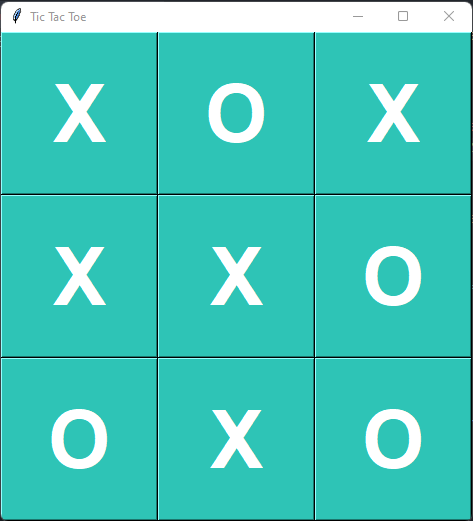

# Tic Tac Toe Game using Python and Tkinter

Welcome to the **Tic Tac Toe Game** repository! This project showcases a classic Tic Tac Toe game built using Python and the Tkinter library for the graphical user interface.

## Features

- **Interactive GUI**: Simple and intuitive graphical user interface built with Tkinter.

## Demo

Check out the live demo of the game in action [Youtube](https://www.youtube.com/watch?v=OhesAHZuLPU).

## Screenshots



## Getting Started

### Prerequisites

To run this project, you need:

- Python 3.x installed on your machine.
- Basic knowledge of Python programming.

### Installation

1. Clone the repository:

   ```bash
   git clone https://github.com/Salow-Studios/Tic-Tac-Toe-Python-Tkinter
   ```

2. Navigate to the project directory:

   ```bash
   cd Tic-Tac-Toe-Python-Tkinter
   ```

3. Run the game:
   ```bash
   python main.py
   ```

## Usage

- **Start the Game**: Launch the script to start the game.
- **Player Moves**: Click on the grid to place your mark (X or O).
- **Game Modes**: Choose between single-player (against AI) or two-player mode.

## Contributing

Contributions are welcome! To contribute:

1. Fork the repository.
2. Create a new branch (`git checkout -b feature-branch`).
3. Make your changes and commit them (`git commit -m 'Add some feature'`).
4. Push to the branch (`git push origin feature-branch`).
5. Open a pull request.

## License

This project is licensed under the MIT License. See the `LICENSE` file for details.

## Acknowledgments

- Built using the Tkinter library for Python.
- Inspired by classic Tic Tac Toe games.
- Special thanks to all contributors and users.

## Contact

For any questions or feedback, feel free to open an issue or contact me at [Twitter](https://x.com/i/flow/login?redirect_after_login=%2FSalowStudios).

---

Enjoy playing Tic Tac Toe! 🎮
